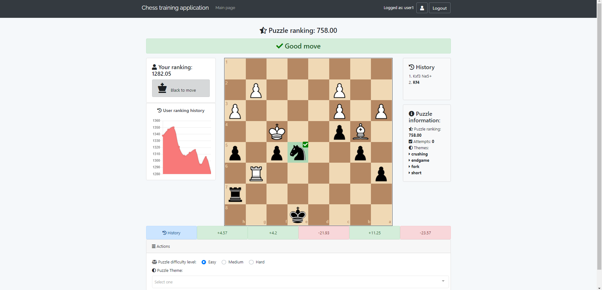
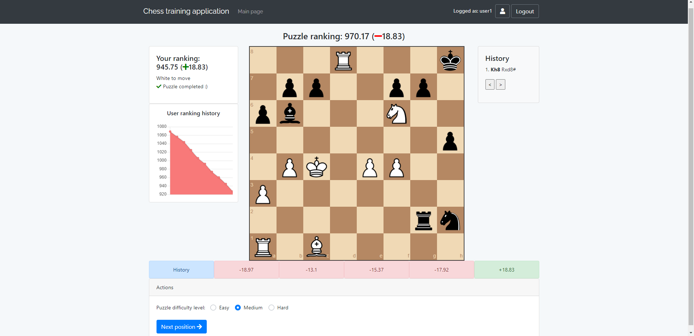
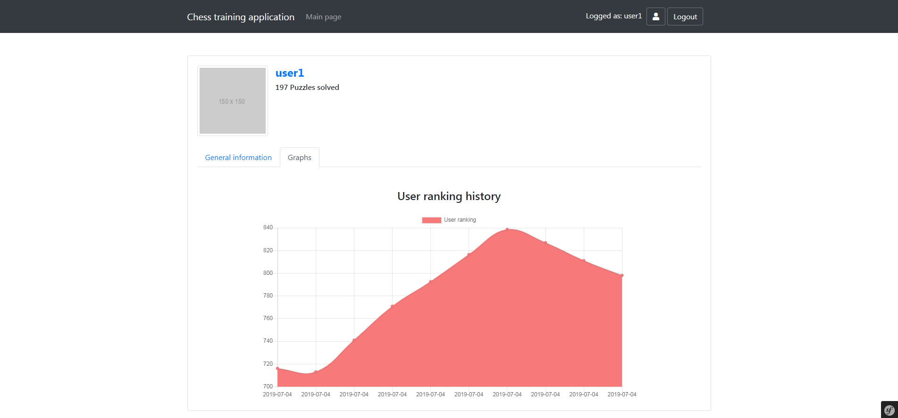
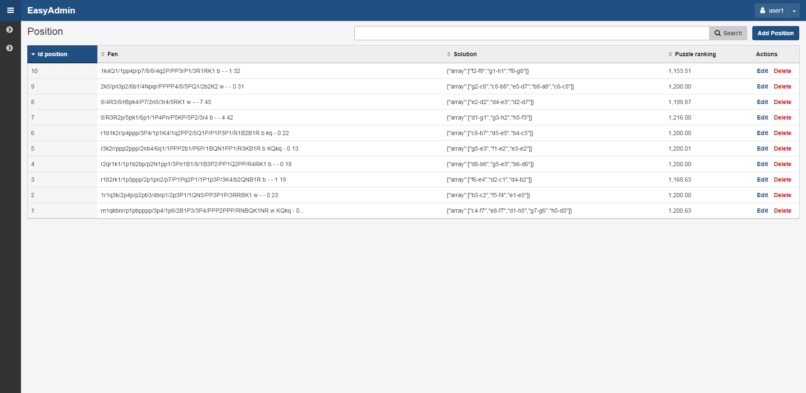
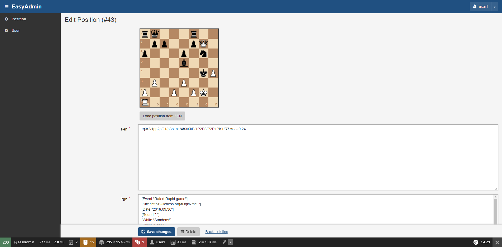

## Table of contents
* [General info](#general-info)
* [Technologies](#technologies)
* [Features](#features)
* [Installation](#installation)
* [Screenshots](#screenshots)

## General info
Symfony/js app to solve chess puzzles using chess.js and chessboard.js libraries. 
The puzzles are loaded into the database from the lichess open database with around 1,5M puzzles. 
	
## Technologies
Project is created with:
* Symfony 3.4
* FOSUserBundle for user login/registration
* Vue.js/Vuex
* Vue-chartjs
* Chess.js
* Chessboard.js
* MySQL database
* EasyAdmin-bundle

## Features
* Solving chess puzzles
* Choosing puzzle difficulty level  
* Computing rating difference for puzzle and user using ELO ranking system.
* Displaying graphs using Chart.js/vue-chartjs libraries
* Displaying time spent on solving a puzzle
* Comes with the admin panel to add new puzzles
* Comes with the data fixtures to load new user. User credentials are: user1/pass1

## Installation
#### Clone the repository
#### Run composer
```
composer install
```
#### Install front-end dependencies
```
yarn install
```
#### Compile assets
```
yarn encore dev
```
#### Run migrations
```
php bin/console doctrine:migrations:migrate
```
#### Download lichess puzzles CSV (https://database.lichess.org/lichess_db_puzzle.csv.bz2) and put it into app/Resources folder. Then run symfony command to load puzzles into the db:
```
php bin/console app:import-puzzle filename
```

#### Load sample user from fixture with append option (prevents purge)
```
php bin/console doctrine:fixtures:load --append
```

## Screenshots

### Homepage

                              
### Puzzle completed
                          

### User profile


### Admin panel


### Adding new positions

