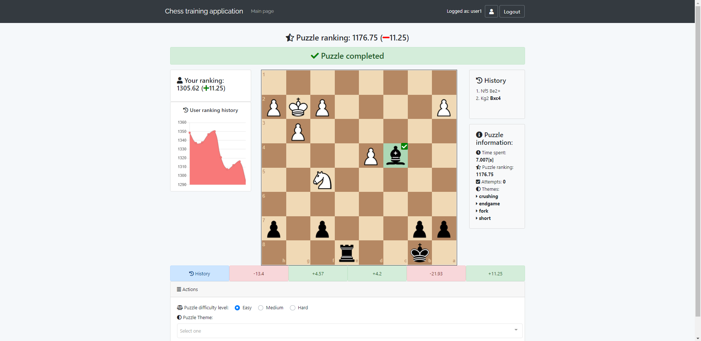

## Table of contents
* [General info](#general-info)
* [Technologies](#technologies)
* [Features](#features)
* [Installation](#installation)
* [Screenshots](#screenshots)

## General info
Symfony/js app to solve chess puzzles using chess.js and chessboard.js libraries. The puzzles are loaded from the database in the PGN/FEN format using AJAX. Puzzle solutions are kept in json array.
	
## Technologies
Project is created with:
* Symfony 3.4
* FOSUserBundle for user login/registration
* RabbitMQ for some asynchronous work
* Vue.js
* Vue-chartjs
* Chess.js
* Chessboard.js
* MySQL database
* EasyAdmin-bundle

## Features
* Solving chess puzzles
* Computing rating difference for puzzle and user using ELO ranking system.
* Displaying graphs using Chart.js/vue-chartjs libraries
* Displaying game history
* Comes with the admin panel to add new puzzles
* Comes with the data fixtures to load new user and 10 puzzles. User credentials are: user1/pass1

## Installation
#### Clone the repository
#### Run composer
```
composer install
```
#### Install front-end dependencies
```
yarn install
```
#### Compile assets
```
yarn encore dev
```
#### Run migrations
```
php bin/console doctrine:migrations:migrate
```
#### Load fixtures
```
php bin/console doctrine:fixtures:load
```
#### Setup rabbitMQ
```
php bin/console rabbitmq:setup-fabric
```

#### Start rabbitMQ consumer process
```
php bin/console rabbitmq:consumer -m 50 process_statistic
```

## Screenshots

### Homepage

                              
### Puzzle completed
                          

### User profile


### Admin panel

